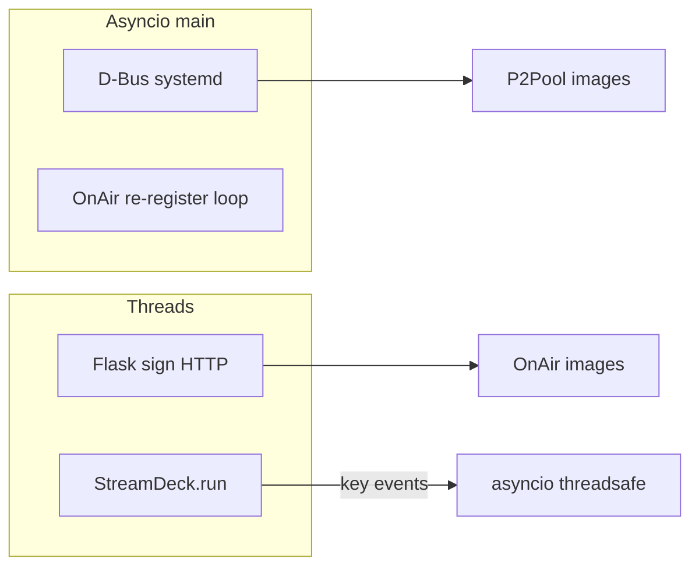

# Task: Implement deckd (VISION + systemd)

* Task ID: deckd-initial
* Complexity: Level 3
* Type: feature

Greenfield Python package: headless Stream Deck Mini daemon with P2Pool (D-Bus) and OnAir (HTTP sign) buttons, `uv` lockfile, tests, example systemd/udev, and README deploy flow.

## Pinned Info

### Runtime architecture

## Component Analysis

### Affected Components

- **`deckd.config`**: Load and validate TOML (`general`, `p2pool`, `onair`, `images`).
- **`deckd.buttons.base`**: `DeckButton` ABC + `update_display` using PILHelper.
- **`deckd.buttons.p2pool`**: Track `ActiveState`, subscribe via D-Bus, `StartUnit`/`StopUnit`, optional `systemctl` fallback.
- **`deckd.buttons.onair`**: Local boolean state, `requests` register/PUT, ties to HTTP server callbacks.
- **`deckd.http_server`**: Flask `GET`/`PUT` `/onair/api/v1/state` (JSON boolean).
- **`deckd.deck`**: Open first Stream Deck, assign keys 0–1 to buttons, keys 2–5 blank.
- **`deckd.__main__`**: Parse args, load config, start Flask thread, start deck thread, run asyncio gather (D-Bus + periodic register), logging.

### Cross-Module Dependencies

- `__main__` → config, deck, buttons, http_server.
- `deck` → buttons; buttons need thread-safe/async hooks to refresh images.
- `onair` button ↔ `http_server` shared mutable state (lock-protected bool).
- `p2pool` → systemd D-Bus; optional subprocess.

### Boundary Changes

- New public CLI: `deckd --config PATH`.
- HTTP sign contract matches existing OnAir sign (JSON boolean).

## Open Questions

- [x] **Thread/async model** → Resolved: asyncio main loop for D-Bus + OnAir periodic register; Flask in daemon thread; StreamDeck `run()` in daemon thread; cross-thread calls via `asyncio.run_coroutine_threadsafe` into the main loop.
- [x] **Python on host 3.10 vs VISION 3.11+** → Resolved: `requires-python >= 3.10` to match Ubuntu 22.04 default; document in README.
- [x] **D-Bus auth failure** → Resolved: try D-Bus; on permission errors log and fall back to `systemctl` subprocess (same unit name).

## Test Plan (TDD)

### Behaviors to Verify

- Config: valid TOML loads; missing keys error clearly.
- HTTP: GET returns cached boolean; PUT updates state and JSON body round-trips.
- OnAir logic: `toggle_put` computes opposite state URL (mock `requests`).
- P2Pool: image paths for active vs inactive (pure function / state helper) where testable without hardware.

### Test Infrastructure

- Framework: **pytest**, **pytest-asyncio** (if needed), **httpx** or Flask `test_client`.
- Location: `tests/`.
- New files: `test_config.py`, `test_http_server.py`, `test_onair_button.py`, `test_p2pool_button.py` (light mocks).

### Integration Tests

- Flask routes with test client only (no real OnAir/D-Bus in CI).

## Implementation Plan

1. **Scaffold** — `pyproject.toml` (hatchling), `deckd/` package, `.gitignore`, `pytest` config, stub `tests/`.
2. **Config** — `deckd/config.py` + `test_config.py` (TDD).
3. **HTTP + OnAir state** — `http_server.py`, `buttons/onair.py` + tests.
4. **P2Pool** — `buttons/p2pool.py`, `systemd_dbus.py` helpers + tests with mocks.
5. **Deck + base** — `buttons/base.py`, `deck.py` (guard hardware with try/import or skip in tests).
6. **Main** — `__main__.py` wiring, logging.
7. **Deploy artifacts** — `deckd.toml.example`, `install/deckd.service`, `install/99-streamdeck.rules`, `images/README.md`, root `README.md`.
8. **uv lock** — run `uv lock` and commit `uv.lock`.

## Technology Validation

- Dependencies per VISION: `streamdeck`, `requests`, `dbus-next`, `flask`; `tomli` for TOML on 3.10 (`tomllib` on 3.11+ optional via stdlib — use `tomli` for one code path on 3.10).

## Challenges & Mitigations

- **No hardware in CI**: do not call `StreamDeck` in unit tests; mock or skip integration.
- **D-Bus on CI**: mock `MessageBus` or test fallback path only.

## Status

- [x] Component analysis complete
- [x] Open questions resolved
- [x] Test planning complete (TDD)
- [x] Implementation plan complete
- [x] Technology validation complete
- [x] Preflight
- [x] Build
- [ ] QA
